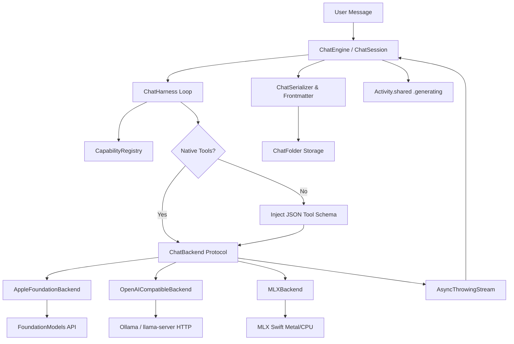

# Requirements

### Overview & Goals
Slice 7 delivers the complete, headless **Chat Engine** for Sotto. It implements the multi-backend model execution layer, conversation harness loop, memory estimation, capability registry, and Markdown persistence with per-turn model attribution.

Per `docs/sotto-build-order.md`, this slice has **no design surface** and contains **no AppKit imports**, keeping it purely testable in headless unit tests.

### Scope

#### In Scope
1. **Unified `ChatBackend` Protocol**: Async streaming contract supporting token-by-token generation, cancellation, and tool execution events.
2. **Apple Foundation Models Backend**: Default on-device backend utilizing `SystemLanguageModel` (`FoundationModels`), owning its own `LanguageModelSession` (separate from cleanup).
3. **OpenAI-Compatible Local Adapter**: HTTP streaming adapter auto-detecting local endpoints (Ollama at `:11434`, `llama-server`, LM Studio).
4. **Embedded `mlx-swift` Backend**: Embedded MLX runner loading local weights, managing KV cache, and streaming tokens on Apple silicon.
5. **Chat Harness Loop (~400 lines)**: Multi-turn loop handling message history, native tool calling, and JSON schema prompt-and-parse fallback for smaller models.
6. **Capability Registry**: Registry mapping `model_id -> { vision: Bool, tools: Bool, max_ctx: Int }`.
7. **Memory Estimator (§2.3)**: Standalone formula `weights + KV + ~15% overhead` with ~60% physical RAM amber advisory threshold.
8. **Markdown Chat Persistence**: Structured YAML frontmatter + Markdown turns, fenced ```` ```selection ```` and ```` ```tool ```` blocks, per-turn model attribution, wired to Slice 5's `ChatFolder`.
9. **Activity Signal Wiring**: Sets `Activity.shared.set(.generating, true/false)` during response generation.

#### Out of Scope
- UI / Compose bar / Floating overlay surfaces (Slice 9 & 10).
- Curated model download manager / HuggingFace download flows (Slice 8).
- Third-party MCP stdio client connections (Slice 12).
- Dictation profiles and cleanup execution (Slice 11).

### User Stories
- **As a user**, I can chat with on-device Apple Intelligence out of the box with zero model downloads.
- **As a user**, I can switch between local MLX models, Ollama, and Apple Foundation Models mid-conversation, with each turn clearly recording which model generated it.
- **As a user**, I can see accurate memory predictions and advisory warnings before loading models or adjusting context windows.
- **As a user**, all my conversations are saved to disk in clean, human-readable Markdown with frontmatter that persists turns, tool calls, and attachments.

### Functional Requirements
1. **Streaming Generation**: All backends emit an `AsyncSequence` of stream chunks with minimal time-to-first-token.
2. **Mid-Conversation Switching**: Changing the active model between turns preserves full conversation history while applying the new model's tokenizer and capabilities.
3. **Tool Execution Loop**: If a model generates tool calls, the harness executes registered tools, appends tool results, and continues generation up to a configurable turn limit.
4. **Tool Fallback**: Models with `tools == false` in `CapabilityRegistry` receive a structured JSON schema instruction and have their JSON output parsed automatically into tool calls.
5. **Memory Estimation Math**: Standalone calculation of exact KV cache and runtime overhead based on layer count, KV heads, head dimension, context length, and element byte size.
6. **Advisory Amber Threshold**: Evaluates whether estimated memory exceeds 60% of physical RAM (`ProcessInfo.processInfo.physicalMemory`).
7. **Frontmatter & Turn Attribution**: Every chat file includes YAML metadata and annotates each assistant response with `### Assistant (model_id)`.

### Non-Functional Requirements
- **No AppKit Imports**: The engine runs in a pure Swift/Foundation module suitable for command-line test runners.
- **Zero Parallel Collision**: Chat owns its own `LanguageModelSession` and never shares instances with `Cleanup.swift` (`DECISIONS.md`, 2026-08-19).
- **Concurrency & Cancellation**: Generating tasks can be cancelled immediately without wedging local backends or memory leaks.

# Technical Design

### Current Implementation & Context
- `Sotto/History/ChatFolder.swift` (Slice 5): Provides low-level file writing for `chat.md` and `attachments/` to `~/Library/Application Support/Sotto/chats/<slug>/`.
- `Sotto/App/Activity.swift` (Slice 1): Houses `Activity.Contributor.generating` for menu bar idle/active state.
- `Sotto/Dictation/Cleanup.swift` (Slice 3/11): Uses `SystemLanguageModel` with `.permissiveContentTransformations`. Confirmed that cleanup owns its own session and chat must own a separate session.

### Key Decisions
1. **Unified `ChatBackend` Protocol**: Abstract internal protocol returning `AsyncThrowingStream<ChatStreamEvent, Error>`. Each backend translates internal `ChatMessage` structs into native tokens, JSON schemas, or framework objects.
2. **Separate Foundation Models Session**: `AppleFoundationBackend` instantiates and manages its own `LanguageModelSession`, isolating chat from dictation cleanup.
3. **Unified Harness with Capability-Based Tool Fallback**: Single harness loop. If `CapabilityRegistry` reports native tools, backend formats native tool schemas; otherwise, harness injects prompt-and-parse JSON schemas.
4. **Standalone Memory Estimator**: Pure functional implementation of `weights + KV + ~15% overhead` consumable across Slice 7, 8, and settings.
5. **Embed `mlx-swift` in Slice 7**: Add `mlx-swift` via Swift Package Manager to `Sotto.xcodeproj` to build the complete native MLX execution engine.

### Data Models & Contracts

```swift
// Capability & Memory
public struct ModelCapability: Sendable, Equatable {
    public let vision: Bool
    public let tools: Bool
    public let maxContext: Int
    public let backendType: BackendType
}

public struct MemoryEstimate: Sendable, Equatable {
    public let weightsBytes: Int
    public let kvCacheBytes: Int
    public let runtimeOverheadBytes: Int
    public let totalBytes: Int
    public let physicalRAMBytes: UInt64
    public let percentageOfRAM: Double
    public var isAmber: Bool { percentageOfRAM >= 0.60 }
}

// Stream Events & Messages
public enum ChatStreamEvent: Sendable {
    case token(String)
    case toolCall(name: String, arguments: [String: AnySendable])
    case turnCompleted(model: String, finishReason: String?)
}

public struct ChatMessage: Sendable, Codable, Equatable {
    public let id: UUID
    public let role: Role // user, assistant, tool, system
    public let content: String
    public let model: String? // for assistant attribution
    public let toolCalls: [ToolCall]?
    public let timestamp: Date
}
```

### Architecture Diagram



### File Structure
```
Sotto/
  Chat/
    ChatBackend.swift           # Protocol, ChatMessage, Stream events, Tool contracts
    ChatEngine.swift            # High-level engine coordinator
    ChatSession.swift           # Multi-turn conversation state
    ChatHarness.swift           # ~400-line tool-calling loop & JSON fallback
    ChatSerializer.swift        # Markdown & YAML frontmatter serialization/deserialization
    CapabilityRegistry.swift    # Model capabilities (vision, tools, context)
    MemoryEstimator.swift       # Standalone weights + KV + overhead calculator
    AppleFoundationBackend.swift # FoundationModels wrapper (separate session)
    OpenAICompatibleBackend.swift# SSE streaming adapter for Ollama/llama-server
    MLXBackend.swift            # Embedded mlx-swift inference runner
```

### Risks & Mitigations
- **`FoundationModels` Concurrency**: Reusing a session throws `concurrentRequests`. *Mitigation*: Each `ChatSession` owns an isolated `LanguageModelSession`.
- **Local Server Availability**: Ollama or llama-server may not be running. *Mitigation*: Graceful error reporting with connection diagnostics without crashing the app.
- **Large Context / Memory Pressure**: Heavy MLX models could cause memory pressure. *Mitigation*: Memory estimator flags amber state past 60% RAM and provides advisory warnings.

# Testing

### Validation Approach
Verification relies on headless Swift unit tests executed in `SottoTests` without requiring any UI or AppKit interactions.

### Key Scenarios
1. **Single-turn Streamed Generation**: Send a message to `ChatSession` and verify tokens stream via `AsyncSequence` to completion.
2. **Mid-Conversation Model Switching**: Send turn 1 with Model A (e.g. Apple Foundation), switch active model to Model B (e.g. OpenAI/Ollama mock or MLX), send turn 2, and verify:
   - Both turns complete successfully.
   - Serialized markdown contains per-turn model attribution (`### Assistant (Apple-Foundation)` and `### Assistant (Model-B)`).
   - YAML frontmatter records both models in the `models:` array.
3. **Tool Execution & Multi-Turn Loop**: Register a mock tool (e.g. `get_weather`), simulate a model emitting a tool call, verify the harness invokes the tool, appends the tool result to the history, and requests the follow-up completion from the model.
4. **JSON Tool Fallback**: Test a model with `tools == false` receiving tool prompt injection and having its JSON response parsed into tool calls.
5. **Memory Estimator Math**: Validate exact byte calculations and amber threshold flags across known model configurations (e.g. Gemma 4 E2B @ 4k context on 8 GB RAM).
6. **Chat Persistence & Roundtrip**: Save a multi-turn chat with attachments and fenced blocks, reload it from disk via `ChatSerializer`, and verify full fidelity.
7. **Activity Contributor**: Verify `Activity.shared.active.contains(.generating)` is true during generation and false after completion.

### Edge Cases
- Stream cancellation: Calling `task.cancel()` aborts the underlying backend stream immediately.
- Corrupted/malformed JSON in tool fallback: Harness handles parse errors gracefully without terminating the session.
- Empty responses or network timeouts on local HTTP endpoints.

# Delivery Steps

### ✓ Step 1: Implement Memory Estimator and Capability Registry
Implement the standalone memory estimator and capability registry with no UI or AppKit dependencies.

- Create `Sotto/Chat/MemoryEstimator.swift` implementing the §2.3 sizing formula: `weights + KV + ~15% overhead` where `KV bytes = 2 * n_layers * n_kv_heads * head_dim * ctx_len * bytes_per_element`.
- Implement system physical RAM detection via `ProcessInfo.processInfo.physicalMemory` and the ~60% amber advisory threshold.
- Create `Sotto/Chat/CapabilityRegistry.swift` mapping `model_id -> ModelCapability(vision, tools, max_ctx, backendType)`.
- Implement capability detection for Apple Foundation Models (`vision: false`, `tools: true`, `max_ctx: 4096`), MLX `config.json` inspection (vision tower detection), and local server `/api/show` parsing.
- Add unit tests in `SottoTests/MemoryEstimatorTests.swift` validating the worked examples from §2.3 and capability parsing.

### ✓ Step 2: Define Unified Backend Protocol and Local Adapters
Build the unified async stream chat backend protocol and implement Apple Foundation Models and OpenAI-compatible local server adapters.

- Create `Sotto/Chat/ChatBackend.swift` defining `ChatBackend`, `ChatMessage`, `ChatTurn`, `ChatRole`, `ToolDefinition`, and `ChatStreamEvent` (tokens, tool call requests, completion metadata).
- Implement `Sotto/Chat/AppleFoundationBackend.swift` wrapping `FoundationModels.SystemLanguageModel` with dedicated `LanguageModelSession` instances (never sharing session with cleanup per `DECISIONS.md`).
- Implement `Sotto/Chat/OpenAICompatibleBackend.swift` supporting streaming Server-Sent Events (SSE) and autodetecting local servers (Ollama `:11434`, `llama-server`, LM Studio).
- Wire `Activity.Contributor.generating` in `Activity.shared` to reflect active response generation during streaming.

### ✓ Step 3: Embed MLX Swift Backend
Integrate `mlx-swift` into the project and implement local embedded MLX model loading, generation, and KV cache management.

- Add the `mlx-swift` package dependency to `Sotto.xcodeproj`.
- Create `Sotto/Chat/MLXBackend.swift` implementing model loading, weight lifecycle, tokenizer decoding, and token streaming via Metal/CPU.
- Implement KV cache allocation and cancellation handling for MLX generation tasks.
- Ensure strict isolation with zero `AppKit` imports in `Sotto/Chat/`.

### ✓ Step 4: Implement Chat Harness, Tool Execution, and Persistence
Build the core conversation loop, native & JSON fallback tool calling, markdown folder persistence, and mid-conversation model switching.

- Create `Sotto/Chat/ChatHarness.swift` implementing the ~400-line loop: messages → model → tool execution → append → repeat, with prompt-and-parse JSON fallback for models lacking native tool calling.
- Create `Sotto/Chat/ChatSession.swift` managing conversation state, multi-turn history, and switching models mid-conversation.
- Create `Sotto/Chat/ChatSerializer.swift` serializing and parsing chat markdown with YAML frontmatter (`created`, `updated`, `contextSize`, `models`), fenced `selection` and `tool` blocks, and per-turn model attribution.
- Wire persistence to `ChatFolder` from Slice 5.
- Add unit tests in `SottoTests/ChatEngineTests.swift` verifying streamed responses, mid-conversation model switching with per-turn attribution, and tool execution.